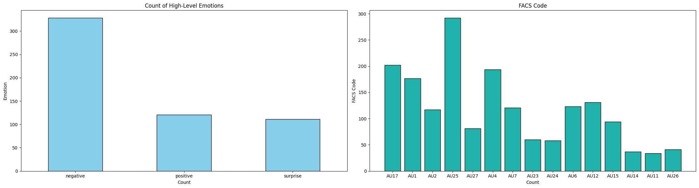
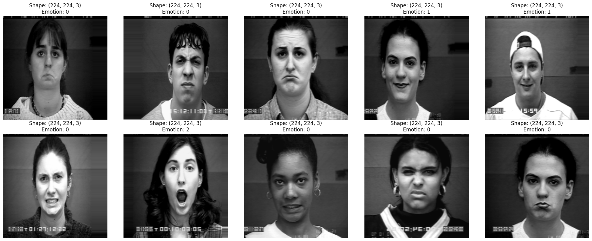
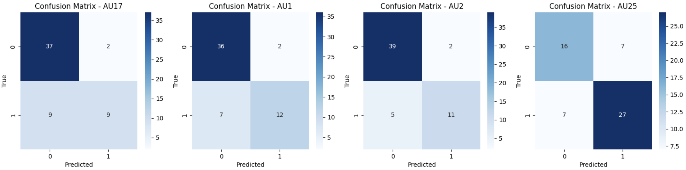

# EmotiScan 🫥

## **Overview**

The aim of the project is to develop an end-to-end trained deep Convolutional Neural Network (CNN) and leverage deep learning techniques to build a model that can automatically detect and classify Facial Emotions and Facial Action Coding System (FACS) codes present in images.

1.   **High-Level Emotion:**
     The first objective of the task is to determine whether the image displays a "Positive," "Negative," or "Surprised" emotion on the subject's face. This involves training the CNN        to recognize and classify different emotional states based on facial expressions.
    
3.   **FACS Codes:**
     The second objective aims to predict whether a particular facial action corresponds to a specific FACS code or not. The FACS codes represent different facial movements and muscle       actions.

This project aims to develop a Facial Expression Recognition (FER) system using deep learning techniques. The primary objective is to create a model capable of accurately classifying facial expressions into predefined categories. The project utilizes a subset of the CK+ dataset, **consisting of only 560 observations**.

## **Dataset**

The dataset employed in this project is a **subset** of the CK+ dataset. Unfortunately, the dataset cannot be shared due to the policy of the publishers. For access to the CK+ dataset, please visit the official [CK+ website](http://www.jeffcohn.net/Resources/).

## **Preview**

## **Highlights**

  - Data Preprocessing: Robust data preprocessing and augmentation techniques were applied to enhance the model's resilience to diverse facial orientations, lighting conditions, and expressions. This contributed to the model's capacity to learn invariant features.

  - Model Architecture: The DenseNet201 architecture, with added dense layers and dropout regularization, proved effective in extracting complex hierarchical features from facial images.

  - Class Weights: Custom class weights were applied, addressing imbalances in the dataset and fostering equitable learning for both emotion and FACS code predictions.

  - Evaluation Metrics: Comprehensive evaluation metrics, including classification reports, confusion matrices, and visualizations, provided a thorough understanding of the model's performance on both emotion labels and individual FACS codes.

## **Future Improvements**

  - Fine-Tuning: While the pre-trained DenseNet201 was beneficial, future work could explore fine-tuning specific layers to adapt the model more closely to the nuances of facial expression data.

  - Data Diversity: Expanding the dataset to include a more diverse range of subjects, facial expressions, and environmental conditions could further enhance the model's generalization capabilities.

  - Interpretable Models: Incorporating techniques for model interpretability, such as Grad-CAM, could provide insights into the specific facial regions influencing predictions.

