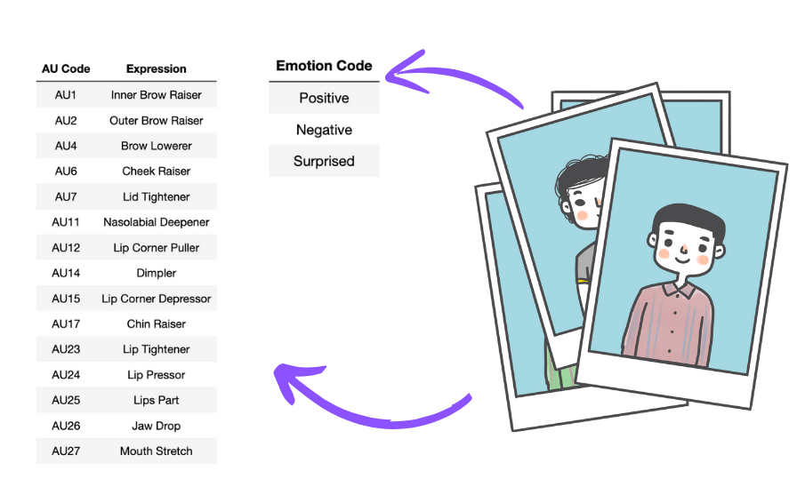

# EmotiScan 🫥

Welcome to EmotiScan, a fun web application that predicts emotions and Facial Action Coding System (FACS) codes from images using advanced deep learning techniques.

## Introduction 

EmotiScan brings the magic of machine learning to recognize emotions and expressions in pictures. With EmotiScan, you can upload an image and receive predictions about the emotions and facial action units displayed in the photo. It's an enjoyable way to explore the subtleties of facial expressions and understand the underlying emotions.

## Features

- **Emotion Prediction**: Detects primary emotions such as happiness, surprise, and negative sentiments.
- **FACS Prediction**: Identifies specific Facial Action Coding System (FACS) codes.
- **User-Friendly Interface**: Simple and intuitive design for easy interaction.
- **Advanced Technology**: Built with state-of-the-art deep learning models for accurate predictions.

## How It Works

1. **Upload Your Image**: Simply upload a photo of a face.
2. **Magic Happens**: Our pre-trained model analyzes the facial features.
3. **Get Results**: You'll receive a prediction of the emotion and FACS codes associated with the facial expressions in the image.



## Preview

The following video illustrates the real-time working and aesthetics of the EmotiScan App

https://github.com/Git-With-Chris/EmotiScan/assets/132337461/0397b1de-e72e-41cf-bd43-127cab9362c9

## Disclaimer

EmotiScan is designed for entertainment and educational purposes only. The predictions provided by the application are not intended for use in critical decision-making processes. EmotiScan's results should not be considered definitive or used for any professional or diagnostic purposes.

## Installation

To set up EmotiScan on your local machine, follow these steps:

1. **Clone the repository**:
    ```bash
    git clone https://github.com/Git-With-Chris/EmotiScan.git
    cd EmotiScan
    ```

2. **Install the required dependencies**:
    ```bash
    pip install -r requirements.txt
    ```

3. **Run the application**:
    ```bash
    streamlit run app.py
    ```

## Project Structure
```text
.
|-- README.md
|-- app.py
|-- images
|   |-- AboutPage.png
|   |-- Data.png
|   |-- Distb.png
|   |-- EDAPicture.png
|   |-- EmotionCM.png
|   |-- FacsCM.png
|   |-- HomePage.png
|   `-- LearningCurves.png
|-- models
|   `-- emotiscan_model.h5
|-- notebooks
|   |-- EDA.ipynb
|   `-- Modelling.ipynb
`-- scripts
    |-- dataloader.py
    |-- plotter.py
    `-- predictions.py

5 directories, 16 files
```
